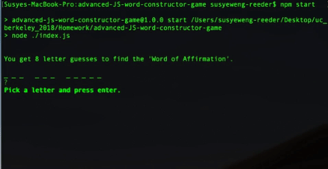

# advanced-JS-word-constructor-game

##This is a Node.js CLI word guessing game built using JavaScript object constructor/classes.

The game starts with a random word selected from the word bank.

• The word is displayed with an underscore representing each letter

The player is prompted for a number of eight guesses

• If the player guesses correctly, the letter is revealed
• If the player guesses incorrectly, the failed attemps will be reduced by one
• The player can only guess a letter once

When the player failed attempts reaches zero

• the game is over 
• the player gets a new word to guess

When the player guesses the word correctly

• the player wins 

##See Demo Here

